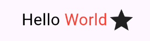

# Flutter Widgets

A group of flutter widgets with modern and elegant look, flexibility, effortless integration, and customization options to enhance your Flutter app's UI and functionality.

## Features 🚀

- **Customizable Widgets**: Every widget within our library is designed with a commitment to customization. Whether you're looking to integrate dynamic text elements, interactive tab bars, or animated list reordering, each component can be tailored to fit the unique requirements and aesthetic preferences of your project.
- **Easy Integration**: We understand that time is money, especially when it comes to development deadlines. That's why our widgets are crafted with effortless integration in mind. With a single command, you can add these powerful tools to your existing Flutter projects, enhancing UI and functionality without the hassle of extensive re-implementations.
- **Modern & Elegant Design**: We believe that great design should be accessible to everyone. That's why our widgets are crafted with a modern and elegant aesthetic that not only looks great but is also user-friendly and easy to navigate.

## Installing Instructions

Adding flutter widgets to any flutter app is just one command away

```bash
dart pub add 'flutter_widgets:{"git":"https://github.com/sostronk/flutter-widgets.git"}'
```


## Usage

```dart
// FlexibleText is a Flutter widget that allows you to seamlessly mix and match rich text segments and widgets within a single text block.
// Customize your text with different styles and gestures, and insert inline widgets using simple placeholders. This powerful and flexible
// solution makes it easy to create dynamic, interactive, and visually appealing text in your Flutter applications.
FlexibleText(
  text: 'Hello :World:~1~~star~',
  style: TextStyle(color: Colors.black),
  richStyles: [TextStyle(color: Colors.red)],
  textRecognizers: [TapGestureRecognizer()..onTap = () { print('World tapped'); }],
  namedWidgets: {'star': Icon(Icons.star)},
  widgets: [Icon(Icons.star)],
);
```

Above snippet will give following output

<p align="center">
  
</p>


```dart
// Skewed TabBar allows you to create a tab bar with skews. This can be an alternative different from the usual tab bar.
class SkewedTabScreen extends StatelessWidget {
  const SkewedTabScreen({super.key});

  @override
  Widget build(BuildContext context) {
    final List<Widget> tabs =
        List.generate(3, (index) => Text('Tab ${index + 1}'));
    return Scaffold(
      appBar: AppBar(
        title: const Text('Skewed Tab Bar'),
      ),
      body: SkewedTabBar(
        tabs: tabs,
        views: tabs
            .map(
              (e) => Container(
                color: Colors.greenAccent,
                alignment: Alignment.center,
                child: e,
              ),
            )
            .toList(),
      ),
    );
  }
}
```

Above snippet will give following output

<p align="center">
  
</p>


```dart
AnimatedReorderList(
        key: const ValueKey('animatedReorderList'),
        keyingFunction: (item) => item.key!,
        items: users,
        duration: const Duration(milliseconds: 600),
        itemBuilder: (context, element) => Container(
          key: element.key,
          margin: const EdgeInsetsDirectional.symmetric(
            horizontal: 10,
            vertical: 5,
          ),
          height: 35,
          color: Colors.greenAccent,
          alignment: Alignment.center,
          child: element,
        ),
      )
```
When the order of list items updates, AnimatedReorderList will auto animate the reorder

```dart
  final tmpListp = List<Widget>.from(users);

        debugPrint('users>> befrroe:\n$users');

        final tmp = tmpListp[1];
        tmpListp[1] = tmpListp[5];
        tmpListp[5] = tmp;

        setState(() {
          users = List<Widget>.from(tmpListp);
          debugPrint('\nusers>> after:\n$users');
        });
```

<p align="center">
  
</p>

## Contributing

See the [contributing guide](CONTRIBUTING.md) to learn how to contribute to the repository and the development workflow.

## License

MIT